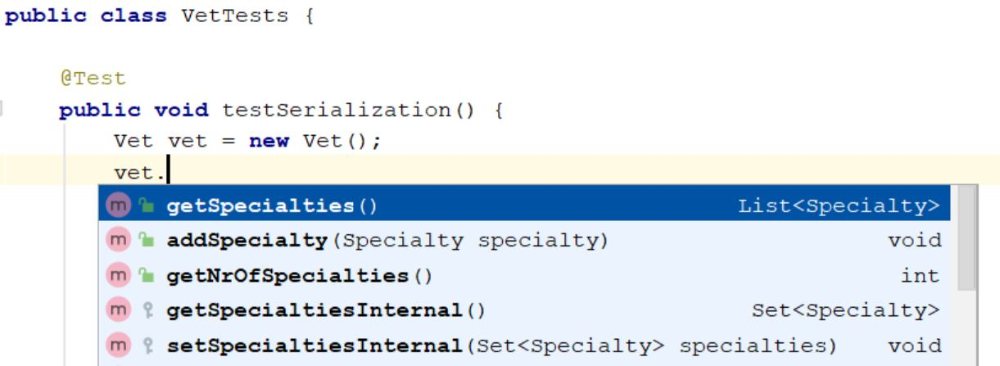

== Classes

Amongst all the weak spots that our clean code review uncovers, the one discussed in this section is both nasty and sneaky.
Other weak spots are good placeholders for readability boosting, but the anomaly we're about to discuss, is a design flow waiting to blow-up
in your face.

When it comes to classes, the main design guideline to be followed is to keep them small.
The interesting bit is that the size of a class is measured, not in lines of code, rather in responsibilities.

=== Principle of Least Astonishment

In clean code, one rule applies, expect the expected, or unexpect the unexpected.

Observe the https://github.com/interventure-growingtogether/spring-petclinic-clean-code/blob/clean-code/src/test/java/org/springframework/samples/petclinic/vet/VetTests.java[VetTests.java] in the `clean-code` branch:

[source,java]
.VetTests.java
----
@Test
public void testAddSpeciality() {
    assertThat(vet.getSpecialties().size()).isEqualTo(0);
}
----

This test passes, so no suprises there. However, lets add a speciality to a `vet`:

[source,java]
.VetTests.java
----
@Test
public void testAddSpeciality() {
    assertThat(vet.getSpecialties().size()).isEqualTo(0);

    Specialty s = new Specialty();
    s.setName("oftamology");
    vet.getSpecialties().add(s);
    assertThat(vet.getSpecialties().size()).isEqualTo(1);
}
----

To my suprise, this test is failing. This is unexpected, and unexpected behaviour is what clean code is aiming to prevent.

[quote, Ward Cunningham]
____
You know you are working on clean code when each routine you read turns out to be pretty much what you expected.
____

The failing test, forces us to see what is the actual implementation of the `getSpecialities()` method.

=== Single Responsibility Principle

Class should have a single, clear and well defined responsibility. Its often phrased like this:

[quote, Robert C. Martin, 'Clean Code - A Handbook of Agaile Software Craftmanshift']
____
The Single Responsibility Principle (SRP) states that a class or module should have one, and only one, reason to change.
____

If you use code completion, the methods that you see should all make sense.
With `Vet.java`, the case is as follows:

[[img-sunset]]

Can you tell what is the difference btw `getSpecialtiesInternal()` and `getSpecialties()`?
Without looking at the code, I would wrongly assume that there exist two fields, `specialties` and `specialtiesInternal`.

There's both `specialities` and `specialitiesInternal` method. Obviously, the class is having two representations of `specialities`, one internal (whatever that might be), one public.
Just by reading the names, one can notice that the `Vet.java` is violating the Single Responsiblity Principle.

=== Mixing Levels of Abstraction

[quote, Robert C. Martin, 'Clean Code - A Handbook of Agaile Software Craftmanshift']
____
Good software design requires that we separate concepts at different levels and place them in different containers. We don’t want lower and higher level concepts mixed together.
____

Here is the complete  https://github.com/interventure-growingtogether/spring-petclinic/blob/master/src/main/java/org/springframework/samples/petclinic/vet/Vet.java[Vet.java]:

[source,java]
.Vet.java
----
import java.util.*;

import javax.persistence.*;
import javax.xml.bind.annotation.XmlElement;

import org.springframework.beans.support.MutableSortDefinition;
import org.springframework.beans.support.PropertyComparator;
import org.springframework.samples.petclinic.model.Person;

@Entity
@Table(name = "vets")
public class Vet extends Person {

    @ManyToMany(fetch = FetchType.EAGER)
    @JoinTable(name = "vet_specialties", joinColumns = @JoinColumn(name = "vet_id"), inverseJoinColumns = @JoinColumn(name = "specialty_id"))
    private Set<Specialty> specialties;

    protected Set<Specialty> getSpecialtiesInternal() {
        if (this.specialties == null) {
            this.specialties = new HashSet<>();
        }
        return this.specialties;
    }

    protected void setSpecialtiesInternal(Set<Specialty> specialties) {
        this.specialties = specialties;
    }

    @XmlElement
    public List<Specialty> getSpecialties() {
        List<Specialty> sortedSpecs = new ArrayList<>(getSpecialtiesInternal());
        PropertyComparator.sort(sortedSpecs,
                new MutableSortDefinition("name", true, true));
        return Collections.unmodifiableList(sortedSpecs);
    }

    public int getNrOfSpecialties() {
        return getSpecialtiesInternal().size();
    }

    public void addSpecialty(Specialty specialty) {
        getSpecialtiesInternal().add(specialty);
    }

}
----

Considering the main responsibility of the class, the only reasonable expectation is that the import section holds only `java.util.\*` and `javax.persistence.*` packages. However, we see imports from `import javax.xml.\*` and `import org.springframework.*`.

If you check how and where the class is being used, you'll notice that its properties are directly accessed from the view as well. This is what's behind the method name confusion, the `getSpecialities()` is accessed from the view.

=== Class Clean Code Refactoring

In fact, the proper SRP refactored `Vet.java` class should look something like:

[source, java]
.Vet.java
----
@Entity
@Table(name = "vets")
public class Vet extends Person {

    @ManyToMany(fetch = FetchType.LAZY)
    @JoinTable(name = "vet_specialties", joinColumns = @JoinColumn(name = "vet_id"), inverseJoinColumns = @JoinColumn(name = "specialty_id"))
    private Set<Specialty> specialties;

    public Set<Specialty> getSpecialties() {
        if (this.specialties == null) {
            this.specialties = new HashSet<>();
        }
        return this.specialties;
    }
}
----

The nastiness of this weak spot reflects in the fact that the impact of change required for fixing it is quite fair. Spring Petclinic, obivously for brewity sake, is missing a business layer. Parts of the responsibilities of this layer are moved to the Vet.java entity, e.g. getSpecialites, addSpecialites method etc. part is moved to Vets.java class, and parts are right in the vetList.html.

Check the code in `clean-code` branch to see the fixes:

[source, java]
.VetViewModel.java
----
@XmlRootElement
public class VetViewModel {

    private String firstName;
    private String lastName;
    private String specialties;

    public VetViewModel(Vet vet) {
        this.firstName = vet.getFirstName();
        this.lastName = vet.getLastName();
        this.specialties = toSpecialities(vet);

    }

    private String toSpecialities(Vet vet) {
        return vet.getSpecialties()
            .stream()
            .map(NamedEntity::getName)
            .sorted()
            .collect(Collectors.joining(" "));
    }

    public String getFirstName() {
        return firstName;
    }

    public String getLastName() {
        return lastName;
    }

    public String getSpecialties() {
        return specialties;
    }
}
----

First we include a https://github.com/interventure-growingtogether/spring-petclinic-clean-code/blob/clean-code/src/main/java/org/springframework/samples/petclinic/vet/VetService.java[VetService.java]:

[source, java]
.VetService.java
----
@Service
public class VetService {

    private VetRepository vetRepository;

    public VetService(VetRepository vetRepository) {
        this.vetRepository = vetRepository;
    }

    @Transactional
    public List<VetViewModel> findVets() {
        return vetRepository.findAll().stream()
        .map(vet -> new VetViewModel(vet))
        .collect(Collectors.toList());
    }
}
----

In addition to small refactors to the test and `VetController` we can consider this SRP violation fixed.

=== Class Clean Code Refactoring Conclusions

Classes should have a single responsibility.
Often times, we take shortcuts and reuse existing classes in additional context.
Typically, this can be OK, if we are early in the process of development, however, the more the project develops,
the more there will be divergence between scenarios.
Eventually, difference use cases will yield different classes.
This is something to keep in mind, so that the impact of change is not too big.

The nasty bit was that we have to change a lot, the sneaky bit has to do with tests, and it follows in the separate blog post

